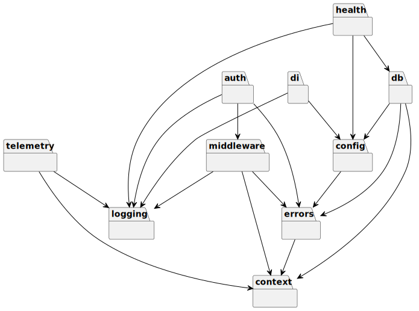

# ServiceLib Developer Guide

## Table of Contents
1. [Introduction](#introduction)
2. [Architecture Overview](#architecture-overview)
3. [Core Components](#core-components)
   - [Authentication](#authentication)
   - [Configuration](#configuration)
   - [Context](#context)
   - [Database](#database)
   - [Dependency Injection](#dependency-injection)
   - [Error Handling](#error-handling)
   - [Health Checks](#health-checks)
   - [Logging](#logging)
   - [Middleware](#middleware)
   - [Telemetry](#telemetry)
   - [Validation](#validation)
4. [UML Diagrams](#uml-diagrams)
   - [Package Dependencies](#package-dependencies)
   - [Authentication Component](#authentication-component)
   - [Dependency Injection Component](#dependency-injection-component)
   - [Health Check Component](#health-check-component)
5. [Usage Examples](#usage-examples)
6. [Best Practices](#best-practices)
7. [Troubleshooting](#troubleshooting)
8. [Contributing](#contributing)

## Introduction

ServiceLib is a comprehensive Go library designed to accelerate the development of robust, production-ready microservices. It provides a collection of reusable components and utilities that address common challenges in service development, allowing developers to focus on business logic rather than infrastructure concerns.

The library follows modern Go practices and design patterns, with a focus on:

- **Modularity**: Each component can be used independently or together with others
- **Testability**: All components are designed with testing in mind
- **Performance**: Optimized for high-throughput microservices
- **Reliability**: Built-in error handling and recovery mechanisms
- **Observability**: Integrated logging, metrics, and tracing

## Architecture Overview

ServiceLib is organized into a set of modular packages, each addressing a specific concern in microservice development. The packages are designed to work together seamlessly but can also be used independently.

The library follows a layered architecture:

1. **Core Layer**: Fundamental utilities like context, errors, and logging
2. **Infrastructure Layer**: Database, configuration, and telemetry
3. **Service Layer**: Authentication, health checks, and middleware
4. **Application Layer**: Validation and application-specific utilities

```
┌─────────────────────────────────────────────────────────────────┐
│                      Application Layer                          │
│                                                                 │
│                 ┌─────────────┐    ┌─────────────┐             │
│                 │  Validation │    │    Other    │             │
│                 └─────────────┘    └─────────────┘             │
└─────────────────────────────────────────────────────────────────┘
┌─────────────────────────────────────────────────────────────────┐
│                        Service Layer                            │
│                                                                 │
│    ┌─────────────┐    ┌─────────────┐    ┌─────────────┐       │
│    │     Auth    │    │    Health   │    │  Middleware │       │
│    └─────────────┘    └─────────────┘    └─────────────┘       │
└─────────────────────────────────────────────────────────────────┘
┌─────────────────────────────────────────────────────────────────┐
│                     Infrastructure Layer                        │
│                                                                 │
│ ┌─────────────┐ ┌─────────────┐ ┌─────────────┐ ┌────────────┐ │
│ │  Database   │ │   Config    │ │  Telemetry  │ │     DI     │ │
│ └─────────────┘ └─────────────┘ └─────────────┘ └────────────┘ │
└─────────────────────────────────────────────────────────────────┘
┌─────────────────────────────────────────────────────────────────┐
│                         Core Layer                              │
│                                                                 │
│    ┌─────────────┐    ┌─────────────┐    ┌─────────────┐       │
│    │   Context   │    │    Errors   │    │   Logging   │       │
│    └─────────────┘    └─────────────┘    └─────────────┘       │
└─────────────────────────────────────────────────────────────────┘
```

## Core Components

### Authentication

The `auth` package provides comprehensive authentication and authorization functionality:

- **JWT Token Handling**: Generate and validate JWT tokens
- **OIDC Integration**: Validate tokens from OpenID Connect providers
- **HTTP Middleware**: Authenticate HTTP requests
- **Role-Based Access Control**: Control access to resources based on user roles

```go
// Create an auth instance
authInstance, err := auth.New(ctx, config, logger)
if err != nil {
    logger.Fatal("Failed to create auth instance", zap.Error(err))
}

// Generate a token
token, err := authInstance.GenerateToken(ctx, "user123", []string{"admin"})

// Validate a token
claims, err := authInstance.ValidateToken(ctx, token)

// Check if the user is authorized
authorized, err := authInstance.IsAuthorized(ctx, "read:resource")
```

### Configuration

The `config` package provides a flexible configuration system:

- **Multiple Sources**: YAML, JSON, environment variables, command-line flags
- **Hierarchical Configuration**: Dot notation for accessing nested values
- **Type Conversion**: Automatic conversion to the appropriate type
- **Default Values**: Fallback values when configuration is missing
- **Validation**: Validate configuration against a schema

```go
// Create a new configuration
cfg, err := config.New("config.yaml", "env.yaml")
if err != nil {
    log.Fatalf("Failed to load configuration: %v", err)
}

// Get a string value
apiKey := cfg.GetString("api.key")

// Get an int value with default
port := cfg.GetInt("server.port", 8080)

// Bind configuration to a struct
var appConfig AppConfig
if err := cfg.Unmarshal(&appConfig); err != nil {
    log.Fatalf("Failed to unmarshal configuration: %v", err)
}
```

### Context

The `context` package extends Go's standard context package:

- **Value Management**: Strongly typed context values
- **Timeout Management**: Utilities for working with context deadlines
- **Cancellation**: Simplified cancellation patterns
- **Propagation**: Utilities for propagating context values across service boundaries

```go
// Create a context with a value
ctx := context.WithValue(context.Background(), "key", "value")

// Get a value from the context
value, ok := context.GetValue(ctx, "key")

// Create a context with a timeout
ctx, cancel := context.WithTimeout(context.Background(), 5*time.Second)
defer cancel()
```

### Database

The `db` package provides database connection management and operations:

- **Connection Management**: Connection pooling, automatic reconnection
- **Transaction Management**: Simplified transaction handling
- **Query Execution**: Execute queries with retries
- **Result Mapping**: Map query results to structs
- **Migrations**: Database schema migrations

```go
// Create a database connection
db, err := db.New(ctx, config)
if err != nil {
    log.Fatalf("Failed to connect to database: %v", err)
}
defer db.Close()

// Execute a query
rows, err := db.Query(ctx, "SELECT * FROM users WHERE id = $1", id)
if err != nil {
    return nil, err
}

// Execute a transaction
err := db.Transaction(ctx, func(tx *sql.Tx) error {
    // Execute queries within the transaction
    _, err := tx.Exec("INSERT INTO users (id, name) VALUES ($1, $2)", id, name)
    return err
})
```

### Dependency Injection

The `di` package provides a container-based dependency injection system:

- **Container Types**: Base container, service container, repository container
- **Constructor Injection**: Inject dependencies through constructors
- **Singleton Instances**: Reuse instances across the application
- **Lazy Initialization**: Initialize dependencies only when needed
- **Circular Dependency Detection**: Detect and prevent circular dependencies

```go
// Create a new DI container
container := di.NewContainer()

// Register dependencies
container.Register("config", cfg)
container.Register("db", db)
container.Register("userRepository", func(c di.Container) (interface{}, error) {
    db, err := c.Get("db")
    if err != nil {
        return nil, err
    }
    return NewSQLUserRepository(db.(*sql.DB)), nil
})

// Resolve dependencies
service, err := container.Get("userService")
if err != nil {
    log.Fatalf("Failed to resolve dependencies: %v", err)
}
```

### Error Handling

The `errors` package provides structured error types and handling:

- **Error Types**: Domain errors, infrastructure errors, application errors
- **Error Wrapping**: Wrap errors with context information
- **Error Codes**: Standardized error codes for consistent handling
- **Localized Error Messages**: Error messages in multiple languages
- **Stack Traces**: Capture stack traces for debugging

```go
// Create a new error
err := errors.New("something went wrong")

// Create an error with a code
err := errors.NewWithCode("invalid_input", "Invalid input provided")

// Wrap an error with context
err := errors.Wrap(err, "failed to process request")

// Check if an error is of a specific type
if errors.Is(err, errors.ErrNotFound) {
    // Handle not found error
}
```

### Health Checks

The `health` package provides components for implementing health check endpoints:

- **Check Types**: Liveness, readiness, and startup checks
- **Check Intervals**: Configure how often checks are performed
- **HTTP Handlers**: Automatically register health check endpoints
- **Status Reporting**: Detailed health status reporting
- **Kubernetes Integration**: Compatible with Kubernetes probes

```go
// Create a health handler
handler := health.NewHandler(config)

// Add liveness checks
handler.AddLivenessCheck("goroutines", health.GoroutineCountCheck(1000))
handler.AddLivenessCheck("memory", health.MemoryUsageCheck(85.0))

// Add readiness checks
handler.AddReadinessCheck("database", checkDatabaseConnection(database))
handler.AddReadinessCheck("api", checkExternalAPI("https://api.example.com/health"))

// Register health check handlers
handler.RegisterHandlers(http.DefaultServeMux)
```

### Logging

The `logging` package provides structured logging with Zap:

- **Log Levels**: Debug, info, warn, error, fatal
- **Structured Logging**: Key-value pairs for better searchability
- **Output Formats**: JSON, console
- **Context-Aware Logging**: Log with context information
- **Performance**: High-performance logging with minimal allocations

```go
// Create a logger
logger, err := logging.NewLogger(logging.Config{
    Level:      "info",
    Format:     "json",
    OutputPath: "stdout",
    ErrorPath:  "stderr",
})
if err != nil {
    panic("Failed to initialize logger: " + err.Error())
}
defer logger.Sync()

// Log messages
logger.Info("Starting server", "address", ":8080")
logger.Error("Failed to connect to database", "error", err)
```

### Middleware

The `middleware` package provides HTTP middleware components:

- **Authentication**: JWT authentication middleware
- **Logging**: Request/response logging
- **Metrics**: Request metrics collection
- **Tracing**: Distributed tracing
- **Recovery**: Panic recovery
- **CORS**: Cross-Origin Resource Sharing
- **Rate Limiting**: Request rate limiting

```go
// Create middleware chain
handler := middleware.Chain(
    mux,
    middleware.RequestID(),
    middleware.Logging(logger),
    middleware.Metrics(),
    middleware.Tracing("example-service"),
    middleware.Recovery(logger),
)

// Start server
server := &http.Server{
    Addr:    ":8080",
    Handler: handler,
}
```

### Telemetry

The `telemetry` package provides utilities for metrics, tracing, and monitoring:

- **Metrics**: Prometheus integration, counter, gauge, histogram metrics
- **Tracing**: OpenTelemetry integration, span creation and management
- **Monitoring**: Health check integration, alerting utilities
- **HTTP Instrumentation**: Automatic instrumentation for HTTP requests
- **Database Instrumentation**: Automatic instrumentation for database operations

```go
// Initialize telemetry
telemetryConfig := telemetry.Config{
    ServiceName:    "example-service",
    ServiceVersion: "1.0.0",
    Environment:    "development",
    TracingEnabled: true,
    MetricsEnabled: true,
}

tp, mp, err := telemetry.InitTelemetry(telemetryConfig)
if err != nil {
    logger.Fatal("Failed to initialize telemetry", "error", err)
}
defer tp.Shutdown(context.Background())
defer mp.Shutdown(context.Background())

// Start a span
ctx, span := telemetry.StartSpan(ctx, "operation-name")
defer span.End()

// Record metrics
telemetry.RecordHTTPRequest(ctx, "GET", "/api/users", 200, 50*time.Millisecond, 1024)
```

### Validation

The `validation` package provides request and data validation:

- **Struct Validation**: Validate struct fields using tags
- **Custom Validators**: Define custom validation rules
- **Error Messages**: Customizable error messages
- **Localization**: Validation errors in multiple languages
- **HTTP Integration**: Validate HTTP request bodies

```go
// Create a validator
validator := validation.New()

// Define a struct with validation tags
type User struct {
    ID       string `validate:"required,uuid"`
    Username string `validate:"required,min=3,max=50"`
    Email    string `validate:"required,email"`
    Age      int    `validate:"gte=18,lte=120"`
}

// Validate a struct
user := User{
    ID:       "123e4567-e89b-12d3-a456-426614174000",
    Username: "johndoe",
    Email:    "john.doe@example.com",
    Age:      30,
}

err := validator.Validate(user)
if err != nil {
    // Handle validation error
}
```

## UML Diagrams

### Package Dependencies

The following diagram shows the dependencies between the main packages in ServiceLib:



For the source PlantUML file, see [package_dependencies.puml](diagrams/source/package_dependencies.puml).

### Authentication Component

The following diagram shows the structure of the authentication component:

```
┌───────────────────────────────────────────────────────────┐
│                         Auth                              │
├───────────────────────────────────────────────────────────┤
│ - jwtService: jwt.Service                                 │
│ - oidcService: oidc.Service                               │
│ - authService: service.Service                            │
│ - middleware: middleware.Middleware                       │
│ - logger: *zap.Logger                                     │
├───────────────────────────────────────────────────────────┤
│ + New(ctx, config, logger): (*Auth, error)                │
│ + Middleware(): func(http.Handler) http.Handler           │
│ + GenerateToken(ctx, userID, roles): (string, error)      │
│ + ValidateToken(ctx, tokenString): (*jwt.Claims, error)   │
│ + IsAuthorized(ctx, operation): (bool, error)             │
│ + IsAdmin(ctx): (bool, error)                             │
│ + HasRole(ctx, role): (bool, error)                       │
│ + GetUserID(ctx): (string, error)                         │
│ + GetUserRoles(ctx): ([]string, error)                    │
└───────────────────────────────────────────────────────────┘
                           │
                           │
                           v
┌───────────────────┐    ┌───────────────────┐    ┌───────────────────┐
│    jwt.Service    │    │   oidc.Service    │    │  service.Service  │
├───────────────────┤    ├───────────────────┤    ├───────────────────┤
│ - config: Config  │    │ - config: Config  │    │ - config: Config  │
│ - logger: Logger  │    │ - logger: Logger  │    │ - logger: Logger  │
├───────────────────┤    ├───────────────────┤    ├───────────────────┤
│ + GenerateToken() │    │ + ValidateToken() │    │ + IsAuthorized()  │
│ + ValidateToken() │    │ + GetUserInfo()   │    │ + IsAdmin()       │
└───────────────────┘    └───────────────────┘    └───────────────────┘
```

### Dependency Injection Component

The following diagram shows the structure of the dependency injection component:

```
┌───────────────────────────────────────────────────────────┐
│                      BaseContainer                        │
├───────────────────────────────────────────────────────────┤
│ - ctx: context.Context                                    │
│ - logger: *zap.Logger                                     │
│ - contextLogger: *logging.ContextLogger                   │
│ - validator: *validator.Validate                          │
│ - config: C                                               │
├───────────────────────────────────────────────────────────┤
│ + NewBaseContainer(ctx, logger, cfg): (*BaseContainer, error) │
│ + GetContext(): context.Context                           │
│ + GetLogger(): *zap.Logger                                │
│ + GetContextLogger(): *logging.ContextLogger              │
│ + GetValidator(): *validator.Validate                     │
│ + GetConfig(): C                                          │
│ + Close(): error                                          │
└───────────────────────────────────────────────────────────┘
                           ^
                           │
                           │
┌───────────────────┐    ┌───────────────────┐    ┌───────────────────┐
│     Container     │    │ ServiceContainer  │    │ RepositoryContainer│
├───────────────────┤    ├───────────────────┤    ├───────────────────┤
│ - BaseContainer   │    │ - BaseContainer   │    │ - BaseContainer   │
├───────────────────┤    ├───────────────────┤    ├───────────────────┤
│ + NewContainer()  │    │ + NewServiceContainer() │ + NewRepositoryContainer() │
│ + GetRepositoryFactory() │ + GetService()     │    │ + GetRepository()  │
└───────────────────┘    └───────────────────┘    └───────────────────┘
```

### Health Check Component

The following diagram shows the structure of the health check component:

```
┌───────────────────────────────────────────────────────────┐
│                      HealthStatus                         │
├───────────────────────────────────────────────────────────┤
│ - Status: string                                          │
│ - Timestamp: string                                       │
│ - Version: string                                         │
│ - Services: map[string]string                             │
└───────────────────────────────────────────────────────────┘
                           ^
                           │
                           │
┌───────────────────────────────────────────────────────────┐
│                      HealthHandler                        │
├───────────────────────────────────────────────────────────┤
│ + NewHandler(provider, logger, cfg): http.HandlerFunc     │
└───────────────────────────────────────────────────────────┘
                           │
                           │
                           v
┌───────────────────────────────────────────────────────────┐
│                  HealthCheckProvider                      │
├───────────────────────────────────────────────────────────┤
│ + GetRepositoryFactory(): interface{}                     │
└───────────────────────────────────────────────────────────┘
```

## Usage Examples

### Creating a Basic Service

```go
package main

import (
    "context"
    "log"
    "net/http"
    "os"
    "os/signal"
    "syscall"
    "time"

    "github.com/abitofhelp/servicelib/config"
    "github.com/abitofhelp/servicelib/di"
    "github.com/abitofhelp/servicelib/health"
    "github.com/abitofhelp/servicelib/logging"
    "github.com/abitofhelp/servicelib/middleware"
    "github.com/abitofhelp/servicelib/telemetry"
)

func main() {
    // Create context
    ctx := context.Background()

    // Load configuration
    cfg, err := config.New("config.yaml")
    if err != nil {
        log.Fatalf("Failed to load configuration: %v", err)
    }

    // Initialize logger
    logger, err := logging.NewLogger(logging.Config{
        Level:      cfg.GetString("logging.level", "info"),
        Format:     cfg.GetString("logging.format", "json"),
        OutputPath: cfg.GetString("logging.output", "stdout"),
        ErrorPath:  cfg.GetString("logging.error", "stderr"),
    })
    if err != nil {
        log.Fatalf("Failed to initialize logger: %v", err)
    }
    defer logger.Sync()

    // Initialize telemetry
    telemetryConfig := telemetry.Config{
        ServiceName:    cfg.GetString("service.name"),
        ServiceVersion: cfg.GetString("service.version"),
        Environment:    cfg.GetString("service.environment"),
        TracingEnabled: cfg.GetBool("telemetry.tracing.enabled", true),
        MetricsEnabled: cfg.GetBool("telemetry.metrics.enabled", true),
    }

    tp, mp, err := telemetry.InitTelemetry(telemetryConfig)
    if err != nil {
        logger.Fatal("Failed to initialize telemetry", "error", err)
    }
    defer tp.Shutdown(ctx)
    defer mp.Shutdown(ctx)

    // Create DI container
    container, err := di.NewContainer(ctx, logger, cfg)
    if err != nil {
        logger.Fatal("Failed to create DI container", "error", err)
    }

    // Create HTTP server with middleware
    mux := http.NewServeMux()

    // Add routes
    mux.HandleFunc("/", func(w http.ResponseWriter, r *http.Request) {
        w.Write([]byte("Hello, World!"))
    })

    // Add Prometheus metrics endpoint
    mux.Handle("/metrics", promhttp.Handler())

    // Create health handler
    healthHandler := health.NewHandler(container, logger, cfg)
    mux.HandleFunc("/health", healthHandler)

    // Create middleware chain
    handler := middleware.Chain(
        mux,
        middleware.RequestID(),
        middleware.Logging(logger),
        middleware.Metrics(),
        middleware.Tracing(cfg.GetString("service.name")),
        middleware.Recovery(logger),
    )

    // Start server
    addr := cfg.GetString("server.address", ":8080")
    server := &http.Server{
        Addr:         addr,
        Handler:      handler,
        ReadTimeout:  cfg.GetDuration("server.readTimeout", 10*time.Second),
        WriteTimeout: cfg.GetDuration("server.writeTimeout", 10*time.Second),
        IdleTimeout:  cfg.GetDuration("server.idleTimeout", 30*time.Second),
    }

    // Start server in a goroutine
    go func() {
        logger.Info("Starting server", "address", addr)
        if err := server.ListenAndServe(); err != nil && err != http.ErrServerClosed {
            logger.Fatal("Server failed", "error", err)
        }
    }()

    // Wait for interrupt signal
    stop := make(chan os.Signal, 1)
    signal.Notify(stop, os.Interrupt, syscall.SIGTERM)
    <-stop

    // Graceful shutdown
    logger.Info("Shutting down server...")
    ctx, cancel := context.WithTimeout(context.Background(), 10*time.Second)
    defer cancel()

    if err := server.Shutdown(ctx); err != nil {
        logger.Fatal("Server shutdown failed", "error", err)
    }

    logger.Info("Server stopped gracefully")
}
```

### Implementing Authentication

```go
package main

import (
    "context"
    "net/http"
    "time"

    "github.com/abitofhelp/servicelib/auth"
    "github.com/abitofhelp/servicelib/logging"
)

func main() {
    // Create logger
    logger, _ := logging.NewLogger(logging.Config{
        Level:  "info",
        Format: "json",
    })
    defer logger.Sync()

    // Create context
    ctx := context.Background()

    // Create auth configuration
    authConfig := auth.Config{
        JWT: auth.JWTConfig{
            SecretKey:     "your-secret-key",
            TokenDuration: 24 * time.Hour,
            Issuer:        "your-service",
        },
        Middleware: auth.MiddlewareConfig{
            SkipPaths:   []string{"/public", "/health"},
            RequireAuth: true,
        },
        Service: auth.ServiceConfig{
            AdminRoleName:        "admin",
            ReadOnlyRoleName:     "reader",
            ReadOperationPrefixes: []string{"read:", "list:", "get:"},
        },
    }

    // Create auth instance
    authInstance, err := auth.New(ctx, authConfig, logger)
    if err != nil {
        logger.Fatal("Failed to create auth instance", "error", err)
    }

    // Create HTTP handler with authentication
    http.Handle("/api/", authInstance.Middleware()(http.HandlerFunc(func(w http.ResponseWriter, r *http.Request) {
        // Check if the user is authorized
        authorized, err := authInstance.IsAuthorized(r.Context(), "read:resource")
        if err != nil {
            http.Error(w, "Authorization error", http.StatusInternalServerError)
            return
        }

        if !authorized {
            http.Error(w, "Forbidden", http.StatusForbidden)
            return
        }

        // Get the user ID
        userID, err := authInstance.GetUserID(r.Context())
        if err != nil {
            http.Error(w, "User ID not found", http.StatusInternalServerError)
            return
        }

        w.Write([]byte("Hello, " + userID))
    })))

    // Start server
    http.ListenAndServe(":8080", nil)
}
```

## Best Practices

### Service Structure

- **Layered Architecture**: Organize your service with clear separation between:
  - API/Transport layer (HTTP, gRPC)
  - Service layer (business logic)
  - Repository layer (data access)

- **Dependency Injection**: Use the DI container to manage dependencies and make testing easier

- **Configuration**: Externalize all configuration and use environment variables for deployment-specific settings

### Error Handling

- **Structured Errors**: Use the errors package to create structured errors with context

```go
if err != nil {
    return errors.NewInfrastructureError("database_error", "Failed to query database", err)
}
```

- **Error Categorization**: Categorize errors to handle them appropriately at the API boundary

```go
switch {
case errors.IsNotFound(err):
    return http.StatusNotFound, errorResponse(err)
case errors.IsValidation(err):
    return http.StatusBadRequest, errorResponse(err)
case errors.IsUnauthorized(err):
    return http.StatusUnauthorized, errorResponse(err)
default:
    return http.StatusInternalServerError, errorResponse(err)
}
```

### Performance Optimization

- **Connection Pooling**: Configure database connection pools based on expected load

```go
db.SetMaxOpenConns(25)
db.SetMaxIdleConns(10)
db.SetConnMaxLifetime(5 * time.Minute)
```

- **Caching**: Use caching for frequently accessed, rarely changed data

- **Pagination**: Always implement pagination for endpoints that return collections

### Testing

- **Unit Tests**: Test each component in isolation using mocks

- **[Integration Tests](Integration_Tests.md)**: Test the integration between components. See the [Integration Tests Guide](Integration_Tests.md) for detailed instructions.

- **End-to-End Tests**: Test the complete service flow

- **Load Tests**: Test performance under load to identify bottlenecks

## Troubleshooting

### Common Issues

#### Connection Pooling

**Issue**: Database connections are not being properly released, leading to connection pool exhaustion.

**Solution**: Ensure that all database operations properly close their resources, especially in error cases. Use the `defer` statement to ensure connections are returned to the pool:

```go
conn, err := db.GetConnection(ctx)
if err != nil {
    return err
}
defer conn.Close() // This ensures the connection is returned to the pool
```

#### Memory Leaks

**Issue**: Memory usage grows over time, indicating potential memory leaks.

**Solution**: Use the telemetry package to monitor memory usage and identify leaks. Common causes include:

- Forgetting to close response bodies
- Goroutines that never terminate
- Large objects stored in context values

#### Circular Dependencies

**Issue**: Dependency injection container fails with circular dependency errors.

**Solution**: Restructure your dependencies to break the cycle. Consider:

- Using interfaces to break direct dependencies
- Introducing a mediator or facade
- Using lazy initialization for some dependencies

### Debugging

#### Enabling Debug Logging

To enable debug logging for troubleshooting:

```go
logger, _ := logging.NewLogger(logging.Config{
    Level: "debug",
    Format: "console", // More readable for debugging
})
```

#### Tracing Requests

For detailed request tracing:

1. Enable the tracing middleware
2. Set the sampling rate to 1.0 (100%)
3. Use the OpenTelemetry UI or Jaeger to view traces

## Contributing

Contributions are welcome! Please feel free to submit a Pull Request. See the [CONTRIBUTING.md](../CONTRIBUTING.md) file for detailed guidelines and instructions.

### Development Workflow

1. Fork the repository
2. Create a feature branch
3. Make your changes
4. Run tests and linting
5. Submit a pull request

### Coding Standards

- Follow Go best practices and style guidelines
- Write tests for new functionality
- Document public APIs
- Keep backward compatibility in mind
